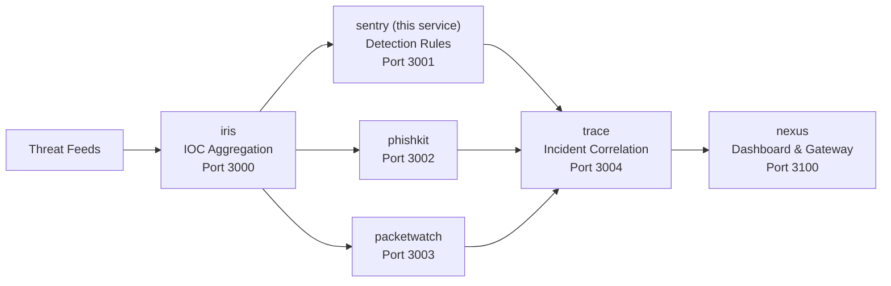

# Sentry — Detection Rule Engine

Sigma-inspired detection rule engine. Loads YAML rules, matches against IOCs (from iris or direct DB), generates findings. Built for the iris ecosystem.

## Quick Start

```bash
git clone https://github.com/makhembu/sentry
cd sentry
cp .env.example .env
npm install
npm run build
npm start
# Server running at http://localhost:3001
```

## Architecture



sentry pulls IOCs from iris, runs them through YAML detection rules, and generates findings for analyst triage.

## Docker

```bash
# Build and run standalone
docker build -t sentry .
docker run -p 3001:3001 sentry

# Run the full ecosystem
docker compose -f ../nexus/docker-compose.yml up
```

## Rule Format (YAML)

Rules live in `rules/` as `.yaml` files:

```yaml
name: C2 Beacon Detection
description: Detects IPs/domains associated with C2 infrastructure
severity: high
category: command-and-control
ioc_types:
  - ip
  - domain
condition:
  any:
    - field: source
      operator: in
      value:
        - abusech
        - talos
    - field: tags
      operator: contains
      value: "c2"
```

Reload rules without restarting:

```bash
curl -X POST http://localhost:3001/rules/reload
```

## API

### Rules

```
GET    /rules?status=active
GET    /rules/:id
POST   /rules/reload
POST   /rules/:id/toggle
```

### Findings

```
GET    /findings?acknowledged=false&severity=critical&ruleId=&limit=50&offset=0
POST   /findings/:id/acknowledge
```

### Matching

```
POST   /match/run
GET    /match/history
```

### Dashboard

```
GET    /dashboard
```

## Demo

```bash
# Health
curl http://localhost:3001/health

# List rules
curl http://localhost:3001/rules

# Run matching against iris IOCs
curl -X POST http://localhost:3001/match/run

# View findings
curl "http://localhost:3001/findings?acknowledged=false"

# Dashboard summary
curl http://localhost:3001/dashboard
```

## Why

Manual IOC hunting doesn't scale. Sentry turns IOCs into actionable findings by matching against detection rules. Designed to sit downstream of iris: iris collects IOCs, sentry applies rules, analysts triage findings.

## Stack

- TypeScript
- Hono
- better-sqlite3
- YAML rule definitions
- Cloudflare Workers + D1 ready

## Roadmap

- [x] YAML rule loading from directory
- [x] Rule matching engine (equals, contains, in, gt, regex)
- [x] Finding generation and deduplication
- [x] Match run history and timing
- [ ] Sigma rule compatibility
- [ ] Correlation rules (time-windowed)
- [ ] Enrichment pipeline (WHOIS, GeoIP on match)
- [ ] Alert forwarding (webhook, email)

## Ecosystem

Part of the threat intelligence ecosystem. iris collects IOCs, sentry applies detection rules, and the pipeline feeds into incident correlation and a unified dashboard:

| Service | Port | Description |
|---------|------|-------------|
| [iris](https://github.com/makhembu/iris) | 3000 | IOC aggregation |
| **sentry** | **3001** | **Detection rules** |
| [phishkit](https://github.com/makhembu/phishkit) | 3002 | Phishing analysis |
| [packetwatch](https://github.com/makhembu/packetwatch) | 3003 | Anomaly detection |
| [trace](https://github.com/makhembu/trace) | 3004 | Incident correlation |
| [nexus](https://github.com/makhembu/nexus) | 3100 | Dashboard & gateway |

Use `threat-stack.ps1` from the repo root to run all services: `.\threat-stack.ps1 start`
